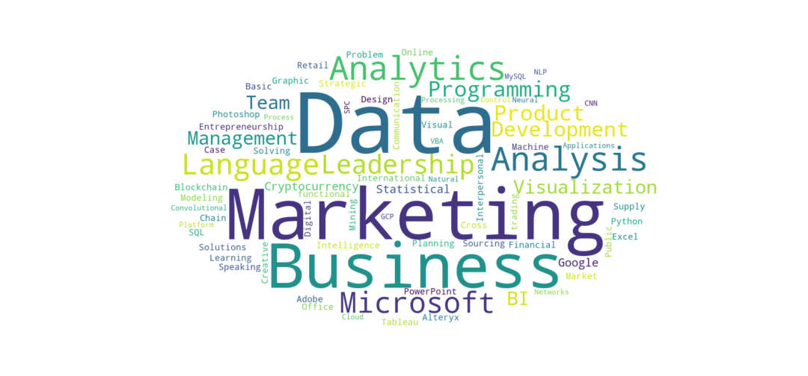
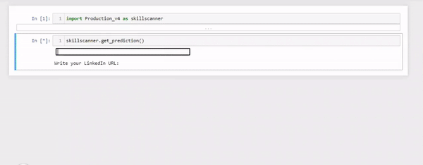

# Final-Project-SkillScanner

Team: 
Yu Ting Hu Wu
Monica Graciela Duarte Arrieche

## 1. Preamble 🏃

Back in 2012, Harvard Business Review declared: [“Data Scientist: The Sexiest Job of the 21st Century.”](https://hbr.org/2012/10/data-scientist-the-sexiest-job-of-the-21st-century). But a decade later, [is Data Scientist Still the Sexiest Job of the 21st Century?](https://hbr.org/2022/07/is-data-scientist-still-the-sexiest-job-of-the-21st-century)

Data Science jobs are more in demand than ever, and will experience more growth than almost any other field between now and 2029, since Artificial Intelligence (AI) is increasingly popular in business, and companies of all sizes and locations need data scientists to develop AI models. 

The assumption in 2012 was that data scientists could do all required tasks in a data science application — from conceptualizing the use case, to interfacing with business and technology stakeholders, to developing the algorithm and deploying it into production. However, due to the fact that no single job role can possess all the skills needed to successfully deploy a complex AI or analytics system, there has been a **proliferation of related jobs** to handle many of those tasks, including machine learning engineer, data engineer, AI specialist, analytics, etc., **leading to some confusion on the scope and responsibilities for each job role**, since all roles combine mathematical and statistical techniques with some empirical research and programming methods to analyze large data sets, obtain insights on patterns, and make predictions for future trends, risks, or investment opportunities.

As a result of this proliferation of skills, companies need to identify the different roles and skills required to effectively deploy data science models in their businesses.

## 2. Project Objective 💥 
In this project, we studied the skills for the three most in demand job roles that have emerged in the recent years across data industry, with the following objectives:

### 2.1. Identify each role skills, which will serve as input for the supervised classification algorithms, for following roles:
* Data Analysis
* Data Science
* Data Engineering

A total of 1842 data profiles were scrapped from Linkedin (73% were data scientist) via API Rest.
After that, Top50 skills per each job category were extracted, we got a total of 80 different skills.
Refer to notebook `Get_skills.ipynb`.

### 2.2 Provide data-driven insights by means of Exploratory Data Analysis.

For this project step, data with job offers information was scrapped from Glassdoor resulting in a dataframe of 12782 rows and 16 columns. See notebook `Jobs_scrapping.ipynb`.

### 2.3. Build Machine Learning models to make a prediction of how a profile fits in each of the job roles.
The predictions are made based on Machine Learning models, which can generate predictions by using skills data extracted from Linkedin and job announcements posted by employers in Glassdoor. 

Considering that, Supervised Learning techniques are used in classification models, and among the several algorithms for supervised classification, the following algorithms were used to build the prediction models:
* Logistic Regression
* KNN (K-Nearest Neighbors)
* PCA (Principal Component Analysis) + Logistic Regression
* Ensemble methods:
  * Random Forest 
  * Gradient Boosting Trees:
      * Gradient Boosting Classifier
      * XGBoost
See notebook `ML_modeling.ipynb`.

### 2.4. Develop a product that is able to:
* Scan the skills from a given Linkedin profile.
* Identify in-demand skills in Data industry.
* Predict how this profile fits in each of the 3 job roles.  

Do you want to scan your profile? Test it by using notebook `SkillScanner_production.ipynb`. 


## 3. Technology Stack 💻
* Programming Language:
    * Python
* General libraries:
    * Numpy
    * Pandas
    * Pickle
    * Regex
    * BeautifulSoup
* Data collection:
    * API REST - Linkedin
    + Web Scrapping - Glassdoor
* EDA & Visualization: 
    * Pandas Profiling
    * Plotly Express
* Predictive Modeling
    * Scikit-Learn

## 4. Summary of Classifications Models Process
* Feature Engineering
    * Label Assignation
    * Feature Encoding
    * Feature Importance
    * Feature Selection
* Preprocessing
    * Split the data (80-20)
    * Check data balance
    * Feature Scaling
* Hyperparameter Tuning
    * Grid Search
    * Cross Validation (10 folds)
    * Multiclass Parameters
* Training & Testing
    * Model Training (80%)
    * Model Testing (20%)
    * Production simulation with unknown data
* Evaluation 
    * Evaluation metrics selection (Accuracy, Precision, Recall, micro f1-score)
    * Classification report
    * Confusion Matrix
    * Results comparison and evaluation

## 5. SkillScanner User Interface



# Folder structure 📁
```
└── Final-Project-SkillScanner
    ├── assets
    │   ├── oval.png
    │   ├── SkillScanner_demo.gif
    │   ├── SkillScanner_logo.png
    │   ├── wordcloud.png
    ├── functions
    │   ├── Main_functions.py
    │   ├── Modeling_functions.py
    │   ├── Production_v4.py
    ├── notebook
    │   ├── Get_skills.ipynb
    │   ├── Jobs_scrapping.ipynb
    │   ├── ML_modeling.ipynb
    │   ├── SkillScanner_production.ipynb
    ├── output
    │   ├── all_data_jobs.csv
    │   ├── best_model_3.pkl
    │   ├── finalized_model_3.pkl
    │   ├── jobs_data.pkl
    │   ├── models_results_3.csv
    │   ├── profiles_data.csv
    │   ├── profiles_data.pkl
    │   ├── profiles_us.csv
    │   ├── profiles_us.pkl
    │   ├── skills_data_var.csv
    │   ├── skills_data_var.pkl
    │   ├── variables_distribution.csv
    │   ├── xgb_model.pkl
    ├── ppt
    │   ├── SkillScanner_Project_presentation_final.pdf  
    ├── README.md
```
